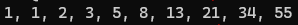

## INSTRUÇÕES DO CLIENTE

Escreva um programa que gera e imprime os primeiros 10 números da sequência de
 Fibonacci utilizando um loop for.

### MODO DE USO

### 1. Instale o Node na sua máquina. Você pode utilizar o nvm para isso. 
**Download and install nvm:**
```
curl -o- https://raw.githubusercontent.com/nvm-sh/nvm/v0.40.3/install.sh | bash
```

**In lieu of restarting the shell**
```
\. "$HOME/.nvm/nvm.sh"
```

**Download and install Node.js:**
```
nvm install 22
```

**Verify the Node.js version:**
```
node -v # Should print "v22.15.0".
nvm current # Should print "v22.15.0".
```

**Verify npm version:**
```
npm -v # Should print "10.9.2".
```

<br />

### 2. Rode o comando abaixo no seu terminal para executar o programa:
```
node main.js
```

**Tenha certeza de estar na pasta do projeto ou indicar o caminho ex:**
```
# Caso o working directory seja -PraTi/exercicios/lista_de_exercicios/v1
node exercicio-15-fibonacci/main.js
```

### 3. Após rodar o programa, digite um número e pressione enter.<br />

